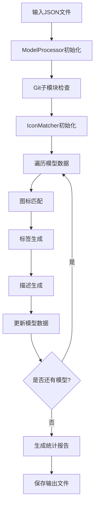

# OWU 模型列表初始化项目

<div align="center">


一个智能的AI模型数据处理工具，自动为AI模型匹配品牌图标、生成标签和描述信息。

</div>

## 📋 目录

- [项目概述](#-项目概述)
- [核心功能](#-核心功能)
- [项目架构](#️-项目架构)
- [快速开始](#-快速开始)
- [详细使用](#-详细使用)
- [配置说明](#️-配置说明)
- [开发指南](#-开发指南)
- [故障排除](#-故障排除)
- [贡献指南](#-贡献指南)
- [许可证](#-许可证)
- [联系方式](#-联系方式)
- [致谢](#-致谢)

## 🎯 项目概述

OWU模型列表初始化项目是一个专门用于处理AI模型数据的Python工具。它能够自动为各种AI模型（如GPT、Claude、Gemini、Qwen等）匹配对应的品牌图标，生成智能标签，并创建详细的模型描述信息。

### 主要特点

- 🎨 **智能图标匹配** - 基于模型名称和ID自动匹配品牌图标
- 🏷️ **自动标签生成** - 根据模型特性智能生成分类标签
- 📝 **描述信息生成** - 为模型自动生成详细的功能描述
- 🔍 **多策略匹配** - 支持精确匹配、厂商映射、关键词匹配和模糊匹配
- 📊 **详细统计报告** - 提供处理结果的完整统计信息
- 🛠️ **模块化设计** - 清晰的代码结构，易于维护和扩展

## ⚡ 核心功能

### 1. 图标匹配系统

- **多级匹配策略**：
  - 精确匹配：直接匹配模型名称
  - 厂商映射：基于预定义的厂商映射规则
  - 关键词匹配：提取模型名称中的关键词
  - 模糊匹配：使用相似度算法进行匹配

- **图标优先级**：
  - 优先选择 `-color.png` 彩色图标
  - 次选无后缀的标准图标
  - 支持SVG、PNG、WEBP多种格式

### 2. 智能标签生成

根据模型特性自动生成标签：

- **厂商标签**：OpenAI、Anthropic、Google、阿里等
- **功能标签**：多模态、文生图、搜索检索、推理思考等
- **特性标签**：免费、付费、实验性等

### 3. 描述信息生成

为缺少描述的模型自动生成：

- 基于模型名称和厂商信息
- 结合模型功能特性
- 提供简洁明了的功能说明

## 🏗️ 项目架构

### 📁 目录结构

```text
owu_model_list_init/
├── README.md                    # 项目文档
├── issues/                      # 任务记录和开发日志
│   └── 模型数据处理任务.md      # 项目需求和实施方案
├── lobe-icons/                  # Git子模块 - AI模型图标库
│   ├── packages/               # 图标包
│   │   ├── static-png/         # PNG格式图标 (推荐)
│   │   │   ├── light/          # 浅色主题图标
│   │   │   └── dark/           # 深色主题图标
│   │   ├── static-svg/         # SVG矢量图标
│   │   └── static-webp/        # WEBP格式图标
│   ├── src/                    # 源码和组件
│   ├── docs/                   # 图标库文档
│   └── README.md               # 图标库说明
├── model_processor/             # 核心处理程序
│   ├── main.py                 # 主程序入口和ModelProcessor类
│   ├── config.py               # 配置文件和映射规则
│   ├── requirements.txt        # Python依赖包列表
│   ├── model_processor.log     # 程序运行日志
│   └── utils/                  # 工具模块包
│       ├── __init__.py         # 模块初始化
│       ├── file_handler.py     # JSON文件读写操作
│       ├── git_handler.py      # Git子模块管理
│       ├── icon_matcher.py     # 智能图标匹配算法
│       ├── tag_generator.py    # 智能标签生成器
│       ├── description_generator.py  # 模型描述生成器
│       └── logger.py           # 统一日志系统
├── models-export-*.json         # 输入的模型数据文件
├── models-export-mod.json       # 处理后的输出文件
└── model_processor.log          # 全局日志文件
```

### 🔧 核心组件架构

#### 1. 主处理器 (ModelProcessor)

```python
class ModelProcessor:
    ├── initialize()           # 初始化子模块和组件
    ├── find_input_file()      # 查找最新的输入文件
    ├── process_models()       # 批量处理模型数据
    ├── process_model()        # 处理单个模型
    ├── generate_report()      # 生成处理统计报告
    └── run()                  # 主执行流程
```

#### 2. 图标匹配器 (IconMatcher)

```python
class IconMatcher:
    ├── exact_match()          # 精确匹配策略
    ├── vendor_mapping_match() # 厂商映射匹配
    ├── keyword_match()        # 关键词匹配
    ├── fuzzy_match()          # 模糊匹配算法
    ├── find_icon_files()      # 查找图标文件
    └── match_icon()           # 主匹配入口
```

#### 3. 标签生成器 (TagGenerator)

```python
class TagGenerator:
    ├── generate_vendor_tags() # 生成厂商标签
    ├── generate_function_tags() # 生成功能标签
    ├── apply_special_rules()  # 应用特殊规则
    └── generate_tags()        # 主标签生成入口
```

#### 4. 描述生成器 (DescriptionGenerator)

```python
class DescriptionGenerator:
    ├── extract_vendor_info()  # 提取厂商信息
    ├── extract_model_features() # 提取模型特征
    ├── build_description()    # 构建描述文本
    └── generate_description() # 主描述生成入口
```

### 🔄 数据流程



## 🚀 快速开始

### 环境要求

- Python 3.7+
- Git（用于子模块管理）

### 安装步骤

1. **克隆项目**

```bash
git clone <repository-url>
cd owu_model_list_init
```

2. **初始化子模块**

```bash
git submodule update --init --recursive
```

3. **安装依赖**

```bash
cd model_processor
pip install -r requirements.txt
```

### 运行程序

```bash
cd model_processor
python main.py
```

程序将自动：

1. 检查并更新lobe-icons子模块
2. 查找最新的模型数据文件
3. 处理模型数据（匹配图标、生成标签和描述）
4. 输出处理结果到 `models-export-mod.json`

## 📖 详细使用

### 输入文件格式

程序会自动查找项目根目录下的 `models-export-{数字}.json` 文件，选择数字最大的文件作为输入。

输入文件应包含模型数组，每个模型对象包含：

```json
{
  "id": "model-id",
  "name": "模型名称",
  "meta": {
    "profile_image_url": "图标URL（可选）",
    "description": "模型描述（可选）",
    "tags": []
  }
}
```

### 输出文件格式

处理后的文件将保存为 `models-export-mod.json`，包含：

- 更新的图标URL
- 智能生成的标签
- 自动生成的描述信息

### 处理统计

程序运行完成后会显示详细的处理统计：

- 总处理模型数量
- 成功匹配图标数量
- 更新标签数量
- 生成描述数量
- 处理耗时
- 失败匹配的模型列表

## ⚙️ 配置说明

### 📋 配置文件概览

所有配置都集中在 `model_processor/config.py` 文件中，包含以下主要配置项：

- **厂商映射配置** - 模型名称到图标文件的映射关系
- **功能关键词配置** - 用于标签生成的功能关键词
- **厂商标签配置** - 图标文件到厂商标签的映射
- **特殊处理规则** - 针对特定模型的特殊处理逻辑
- **图标路径配置** - 图标文件的本地路径和CDN地址
- **日志配置** - 日志级别和格式设置

### 🏢 厂商映射配置

厂商映射是核心配置，将模型名称关键词映射到对应的图标文件名：

```python
VENDOR_MAPPING = {
    # OpenAI系列
    'gpt': 'openai',
    'openai': 'openai',
    'dall-e': 'dalle',
    'o1': 'openai',
    'o3': 'openai',
    'text-embedding': 'openai',
    'tts': 'openai',

    # Anthropic系列
    'claude': 'claude',
    'anthropic': 'anthropic',

    # Google系列
    'gemini': 'gemini',
    'palm': 'palm',
    'bard': 'gemini',
    'imagen': 'gemini',
    'chat-bison': 'palm',
    'text-bison': 'palm',

    # 阿里系列
    'qwen': 'qwen',
    'qvq': 'qwen',
    'qwq': 'qwen',
    'tongyi': 'qwen',

    # 其他主流厂商
    'deepseek': 'deepseek',
    'grok': 'grok',
    'llama': 'meta',
    'mistral': 'mistral',
    'cohere': 'cohere',
    # ... 更多映射
}
```

### 🏷️ 功能关键词配置

用于根据模型名称和描述自动生成功能标签：

```python
FUNCTION_KEYWORDS = {
    '推理思考': ['thinking', 'reasoning', 'r1', 'o1', 'qwq', 'qvq'],
    '文生图': ['image', 'generation', 'dall-e', 'dalle', 'imagen'],
    '图生图': ['image-to-image', 'img2img', 'vision', 'edit'],
    '语音处理': ['tts', 'speech', 'voice', 'omni', 'whisper'],
    '视频处理': ['video', 'generation', 'veo'],
    '多模态': ['vision', 'multimodal', 'vl', 'omni'],
    '搜索检索': ['search', 'web', 'browse', 'retrieval'],
    '嵌入向量': ['embedding', 'embed', 'vector'],
    '免费': ['free', 'fovt', '公益'],
}
```

### 🎯 厂商标签配置

将匹配到的图标文件映射为厂商标签：

```python
VENDOR_TAGS = {
    'openai': ['openai'],
    'claude': ['claude'],
    'gemini': ['gemini'],
    'google': ['google'],
    'palm': ['google'],
    'qwen': ['qwen'],
    'deepseek': ['deepseek'],
    'siliconcloud': ['硅基流动'],
    # ... 更多厂商标签
}
```

### ⚡ 特殊处理规则

针对特定模型的特殊处理逻辑：

```python
SPECIAL_RULES = {
    # 硅基流动特殊处理
    'siliconcloud': {
        'url_pattern': 'siliconcloud-color.png',
        'tags': ['硅基流动']
    },

    # Qwen系列特殊处理
    'qwen2.5-max': {
        'tags': ['推理思考']
    },
    'qwen2.5-vl': {
        'tags': ['多模态']
    },

    # Gemini系列特殊处理
    'gemini-2.0-flash-preview-image-generation': {
        'tags': ['文生图']
    },

    # 免费模型标记
    'fovt': {
        'tags': ['免费']
    },
    # ... 更多特殊规则
}
```

### 🖼️ 图标配置

```python
# 图标文件路径配置
ICON_BASE_PATH = "lobe-icons/packages/static-png/light"
ICON_BASE_URL = "https://registry.npmmirror.com/@lobehub/icons-static-png/latest/files/light"

# 图标优先级：
# 1. {name}-color.png (彩色图标，优先)
# 2. {name}.png (标准图标)
```

### 📝 日志配置

```python
# 日志级别配置
LOG_LEVEL = logging.INFO  # DEBUG, INFO, WARNING, ERROR

# 日志格式配置
LOG_FORMAT = '%(asctime)s - %(name)s - %(levelname)s - %(message)s'
```

### 🔧 自定义配置

#### 添加新厂商

1. 在 `VENDOR_MAPPING` 中添加关键词映射：

```python
'new_model_keyword': 'new_vendor_icon_name'
```

2. 在 `VENDOR_TAGS` 中添加标签映射：

```python
'new_vendor_icon_name': ['厂商标签']
```

3. 确保 `lobe-icons` 中存在对应的图标文件

#### 添加新功能标签

在 `FUNCTION_KEYWORDS` 中添加新的功能类别：

```python
'新功能标签': ['keyword1', 'keyword2', 'keyword3']
```

#### 添加特殊处理规则

在 `SPECIAL_RULES` 中为特定模型添加规则：

```python
'specific-model-name': {
    'tags': ['特殊标签1', '特殊标签2'],
    'url_pattern': 'custom-icon.png'  # 可选
}
```

## 🔧 开发指南

### 代码结构说明

#### 主要模块

1. **main.py** - 程序入口
   - `ModelProcessor` 类：主要的处理器类
   - 负责协调各个工具模块的工作

2. **config.py** - 配置管理
   - 厂商映射规则
   - 图标路径配置
   - 日志配置

3. **utils/file_handler.py** - 文件操作
   - JSON文件读写
   - 文件路径处理
   - 错误处理

4. **utils/git_handler.py** - Git操作
   - 子模块初始化和更新
   - 路径验证

5. **utils/icon_matcher.py** - 图标匹配
   - 多策略匹配算法
   - 相似度计算
   - 图标文件查找

6. **utils/tag_generator.py** - 标签生成
   - 基于规则的标签生成
   - 厂商标签识别
   - 功能标签推断

7. **utils/description_generator.py** - 描述生成
   - 模板化描述生成
   - 基于模型特征的描述

8. **utils/logger.py** - 日志系统
   - 统一的日志配置
   - 多级别日志输出

### 扩展开发

#### 添加新的厂商映射

在 `config.py` 中的 `VENDOR_MAPPING` 字典中添加新的映射关系：

```python
VENDOR_MAPPING = {
    # 现有映射...
    'new_model_keyword': 'new_vendor_icon_name',
}
```

#### 自定义标签规则

在 `utils/tag_generator.py` 中修改标签生成逻辑：

```python
def generate_tags(self, model_data, icon_name):
    # 添加自定义标签逻辑
    custom_tags = self._generate_custom_tags(model_data)
    return base_tags + custom_tags
```

#### 添加新的匹配策略

在 `utils/icon_matcher.py` 中添加新的匹配方法：

```python
def custom_match(self, model_name, model_id):
    # 实现自定义匹配逻辑
    return MatchResult(matched=True, icon_name="custom", ...)
```

### 测试

#### 运行测试

```bash
cd model_processor
python -m pytest tests/
```

#### 手动测试

```bash
# 测试单个模型处理
python -c "
from main import ModelProcessor
processor = ModelProcessor()
processor.initialize()
result = processor.process_model({'name': 'gpt-4', 'id': 'gpt-4'})
print(result)
"
```

## 🐛 故障排除

### 常见问题

#### 1. 子模块初始化失败

**问题**：`lobe-icons子模块初始化失败`

**解决方案**：

```bash
# 手动初始化子模块
git submodule update --init --recursive
# 或者强制更新
git submodule update --remote --force
```

#### 2. 图标文件未找到

**问题**：大量模型无法匹配到图标

**解决方案**：

1. 检查 `lobe-icons` 子模块是否正确初始化
2. 验证图标文件路径：`lobe-icons/packages/static-png/light/`
3. 检查网络连接，确保可以访问图标CDN

#### 3. JSON文件格式错误

**问题**：`加载模型数据失败`

**解决方案**：

1. 验证JSON文件格式是否正确
2. 检查文件编码（应为UTF-8）
3. 使用JSON验证工具检查语法

#### 4. 权限问题

**问题**：无法写入输出文件

**解决方案**：

```bash
# 检查文件权限
ls -la models-export-mod.json
# 修改权限
chmod 644 models-export-mod.json
```

### 调试模式

启用详细日志输出：

```python
# 在config.py中修改
LOG_LEVEL = logging.DEBUG
```

或者在运行时设置：

```bash
export LOG_LEVEL=DEBUG
python main.py
```

### 性能优化

#### 大文件处理

对于包含大量模型的文件：

1. **分批处理**：修改 `process_models` 方法支持分批处理
2. **并行处理**：使用多线程处理模型数据
3. **缓存机制**：缓存图标匹配结果

```python
# 示例：分批处理
def process_models_batch(self, models_data, batch_size=100):
    for i in range(0, len(models_data), batch_size):
        batch = models_data[i:i+batch_size]
        # 处理批次
```

## 🤝 贡献指南

### 贡献方式

1. **Fork** 项目到你的GitHub账户
2. **创建** 功能分支 (`git checkout -b feature/AmazingFeature`)
3. **提交** 你的修改 (`git commit -m 'Add some AmazingFeature'`)
4. **推送** 到分支 (`git push origin feature/AmazingFeature`)
5. **创建** Pull Request

### 代码规范

- 遵循 PEP 8 Python代码规范
- 添加适当的注释和文档字符串
- 编写单元测试
- 确保代码通过所有测试

### 提交信息规范

```text
类型(范围): 简短描述

详细描述（可选）

相关Issue: #123
```

类型包括：

- `feat`: 新功能
- `fix`: 修复bug
- `docs`: 文档更新
- `style`: 代码格式调整
- `refactor`: 代码重构
- `test`: 测试相关
- `chore`: 构建过程或辅助工具的变动

## � 许可证

本项目采用 MIT 许可证 - 查看 [LICENSE](LICENSE) 文件了解详情。

### MIT License

```text
MIT License

Copyright (c) 2025 OWU Model List Init Project

Permission is hereby granted, free of charge, to any person obtaining a copy
of this software and associated documentation files (the "Software"), to deal
in the Software without restriction, including without limitation the rights
to use, copy, modify, merge, publish, distribute, sublicense, and/or sell
copies of the Software, and to permit persons to whom the Software is
furnished to do so, subject to the following conditions:

The above copyright notice and this permission notice shall be included in all
copies or substantial portions of the Software.

THE SOFTWARE IS PROVIDED "AS IS", WITHOUT WARRANTY OF ANY KIND, EXPRESS OR
IMPLIED, INCLUDING BUT NOT LIMITED TO THE WARRANTIES OF MERCHANTABILITY,
FITNESS FOR A PARTICULAR PURPOSE AND NONINFRINGEMENT. IN NO EVENT SHALL THE
AUTHORS OR COPYRIGHT HOLDERS BE LIABLE FOR ANY CLAIM, DAMAGES OR OTHER
LIABILITY, WHETHER IN AN ACTION OF CONTRACT, TORT OR OTHERWISE, ARISING FROM,
OUT OF OR IN CONNECTION WITH THE SOFTWARE OR THE USE OR OTHER DEALINGS IN THE
SOFTWARE.
```

## 📞 联系方式

如有问题或建议，请通过以下方式联系：

### 🐛 问题反馈

- **GitHub Issues**: [创建新Issue](../../issues/new)
- **Bug报告**: 请使用Issue模板提供详细信息
- **功能请求**: 欢迎提出新功能建议

### 💬 讨论交流

- **GitHub Discussions**: [参与讨论](../../discussions)
- **技术交流**: 分享使用经验和最佳实践
- **问题求助**: 获取社区帮助和支持

### 📧 直接联系

- **项目维护者**: [your-email@example.com](mailto:your-email@example.com)
- **技术支持**: 复杂问题可直接邮件联系
- **合作咨询**: 商业合作和定制开发

### 🔗 相关链接

- **项目主页**: [GitHub Repository](https://github.com/your-username/owu_model_list_init)
- **在线文档**: [项目文档站点](https://your-docs-site.com)
- **更新日志**: [CHANGELOG.md](CHANGELOG.md)

## �🙏 致谢

### 开源项目

- **[LobeHub](https://github.com/lobehub)** - 提供优秀的AI工具生态
- **[Lobe Icons](https://github.com/lobehub/lobe-icons)** - AI/LLM模型品牌图标集合
- **[Python](https://python.org)** - 强大的编程语言支持

### 社区贡献

感谢所有为项目做出贡献的开发者和用户：

- 提交代码和修复bug的贡献者
- 提供反馈和建议的用户
- 帮助完善文档的志愿者
- 推广和分享项目的支持者

### 特别鸣谢

- **AI模型厂商** - 为AI技术发展做出的贡献
- **开源社区** - 提供的技术支持和最佳实践
- **用户社区** - 持续的反馈和改进建议

---

<div align="center">

**[⬆ 回到顶部](#owu-模型列表初始化项目)**

Made with ❤️ by AI Assistant | Powered by Python & Open Source

</div>
